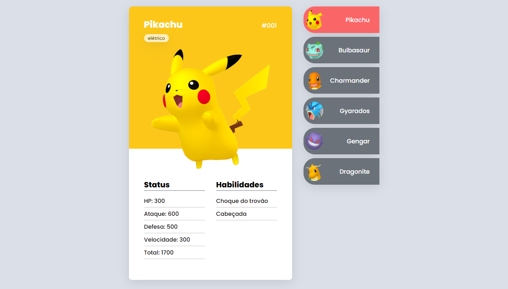
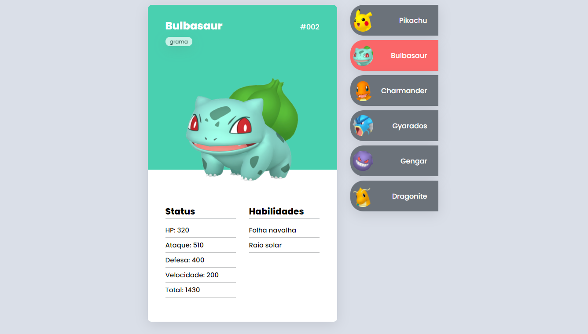
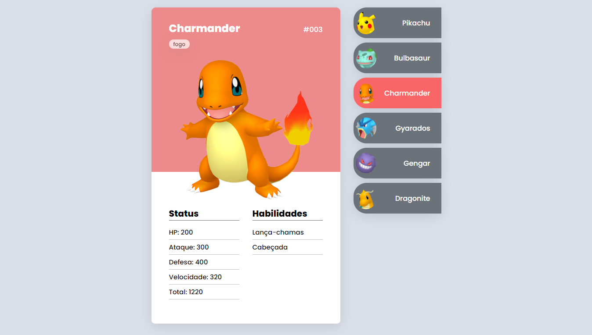
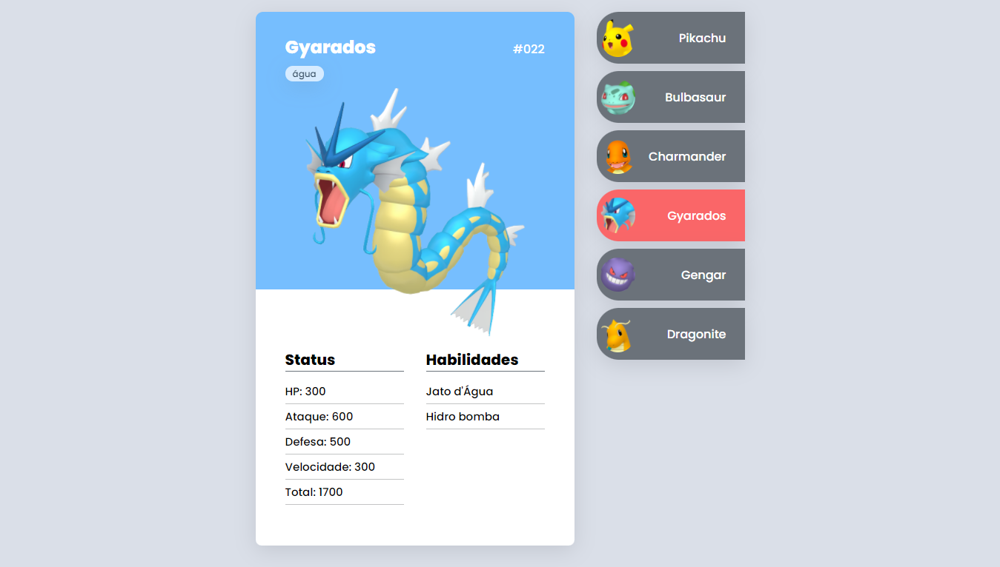
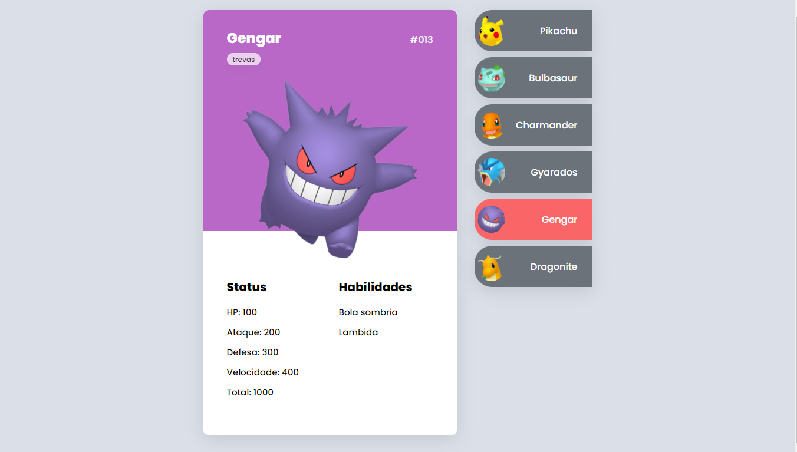
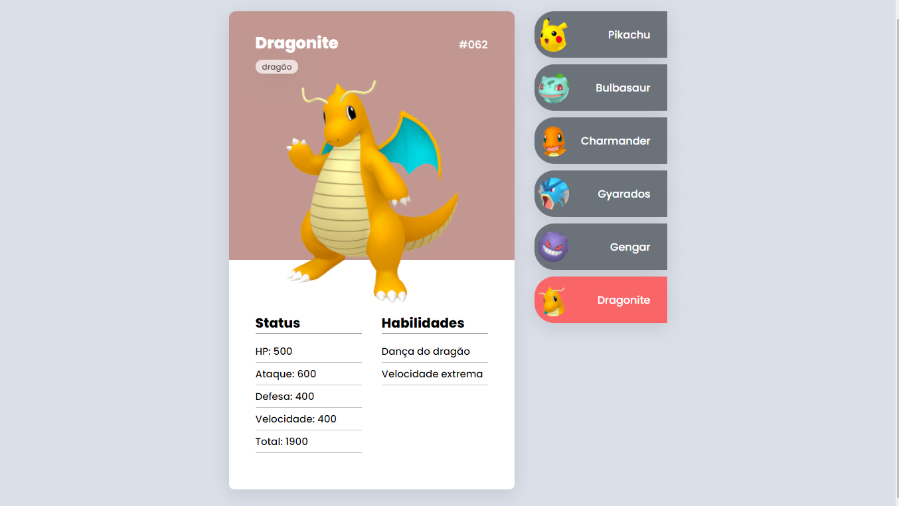

# Pokedex

## Sobre o projeto

Este é um projeto que foi desenvolvido durante a semana do Mapadev week dos irmãos Ricardo e Roberto Dias, do Devemdobro, onde eles ensinaram a desenvolver um mini-game de Pokedex. 
O objetivo do projeto foi aprender o HTML5 semântico, aprender com o CSS fazer cards, onde cada pokemon tem seu próprio card e deixar o layout bem interativo com o usuário. Já no JavaScript foi aprendido alguns conceitos importantes como eventos de cliques, e acessar os cards de cada pokemon com a DOM. Projeto totalmente responsivo, se adapta em vários formatos de tela.

## Tecnologias utilizadas

- HTML5
- CSS3
- JavaScript
- Fontes do Google

## Layout do projeto

